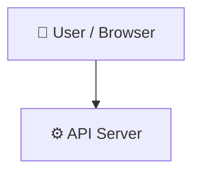

# rawe-dog

> Open-source framework for generating ATS-optimized, grounded resumes using AI models.
[Raw Dog a Resume Today → RAWEDOG.COM](https://rawedog.com)

    

## 📑 Table of Contents

- [Description](#description)
- [Key Features](#key-features)
- [Use Cases](#use-cases)
- [Tech Stack](#tech-stack)
- [Architecture](#architecture)
- [Quick Start](#quick-start)
- [Key Dependencies](#key-dependencies)
- [Available Scripts](#available-scripts)
- [API Endpoints](#api-endpoints)
- [Project Structure](#project-structure)
- [Development Setup](#development-setup)
- [Contributors](#contributors)
- [Contributing](#contributing)
- [License](#license)

## 📝 Description

RAWE-DOG (Resume And Work Experience - Document Output Generator) is an open-source framework designed to build high-quality, ATS-optimized resumes and career documents. Instead of relying on generic LLM prompts that risk hallucinating achievements, RAWE-DOG anchors generative models in a structured personal knowledge base to produce authentic, role-aligned career materials.

The framework structures personal career data into three core layers: a Master Profile for alignment rules and skill indexes, System Instructions to direct LLMs as virtual hiring managers, and detailed Experience Files containing S.T.A.R. stories. The repository is structured as a TypeScript monorepo featuring an Express API server with Pino logging and CORS support, alongside a React interface powered by Vite for document prototyping.

RAWE-DOG is designed for job seekers, technical professionals, and privacy-conscious users who want full ownership of their personal data and prefer leveraging their own preferred LLM providers over third-party SaaS resume tools.

## ✨ Key Features

- **🗂️ Three Layer Knowledge Architecture** — Organizes career history using a Master Profile, System Instructions, and granular Experience Files to keep LLM outputs factual.
- **⚡ Express REST API Server** — Provides an Express-based API server artifact configured with CORS support and structured Pino HTTP request logging.
- **🖥️ React Mockup Sandbox Interface** — Includes a Vite-powered React frontend sandbox for testing and prototyping document layouts and previews.
- **🛠️ TypeScript Monorepo Workspace** — Uses pnpm workspaces with shared base TypeScript configurations and modular build scripts.
- **🤖 Model Agnostic Framework** — Formats career data into system and experience prompts compatible with any LLM provider or local model.

## 🎯 Use Cases

- Generating targeted, ATS-optimized resumes and cover letters grounded in verifiable personal achievements.
- Maintaining a single source of truth for career history, S.T.A.R. impact stories, and skill alignment tables.
- Prototyping custom resume rendering and career document output pipelines via the Express API server.

## 🛠️ Tech Stack

  

## 🏗️ Architecture

A high-level view of how the main pieces fit together:



## ⚡ Quick Start

```bash

# 1. Clone the repository
git clone https://github.com/ThatOtherZach/rawe-dog.git

# 2. Install dependencies
npm install

# 3. Start the dev server
npm run dev
```

## 📦 Key Dependencies

```
@replit/connectors-sdk: ^0.4.1
```

## 🚀 Available Scripts

- **preinstall** — `npm run preinstall`
- **build** — `npm run build`
- **typecheck:libs** — `npm run typecheck:libs`
- **typecheck** — `npm run typecheck`

## 🌐 API Endpoints

Detected endpoints (best-effort scan):

```
/api/export
/api/generate
/api/health
/api/library/file
/api/library
/api/settings
```

## 🛠️ Development Setup

### Node.js / JavaScript
1. Install Node.js (v18+ recommended)
2. Install dependencies: `npm install` (or `yarn` / `pnpm install` / `bun install`)
3. Start the dev server: see the **Quick Start** above

## 👥 Contributors

Thanks to everyone who has contributed to this project:

<p align="left">
<a href="https://github.com/replit-agent" title="replit-agent"></a>
<a href="https://github.com/ThatOtherZach" title="ThatOtherZach"></a>
</p>

[See the full list of contributors →](https://github.com/ThatOtherZach/rawe-dog/graphs/contributors)

## 👥 Contributing

Contributions are welcome! Here's the standard flow:

1. **Fork** the repository
2. **Clone** your fork: `git clone https://github.com/ThatOtherZach/rawe-dog.git`
3. **Branch**: `git checkout -b feature/your-feature`
4. **Commit**: `git commit -m 'feat: add some feature'`
5. **Push**: `git push origin feature/your-feature`
6. **Open** a pull request

Please follow the existing code style and include tests for new behavior where applicable.

## 📜 License

This project is licensed under the **MIT** License.

---

<div align="center">

[](https://readmebuddy.com)

<sub>Generate beautiful READMEs in seconds → <a href="https://readmebuddy.com">readmebuddy.com</a></sub>

</div>
